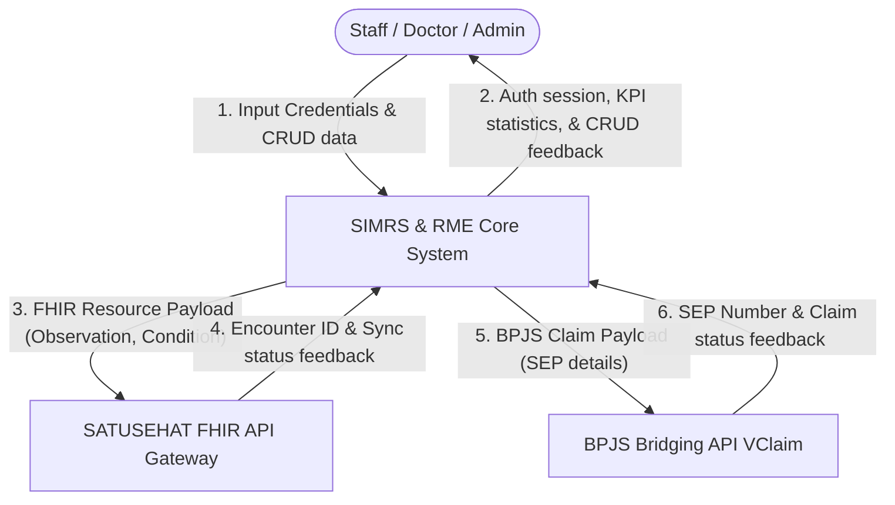
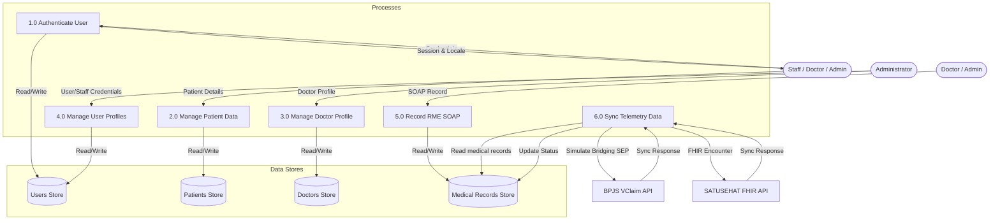
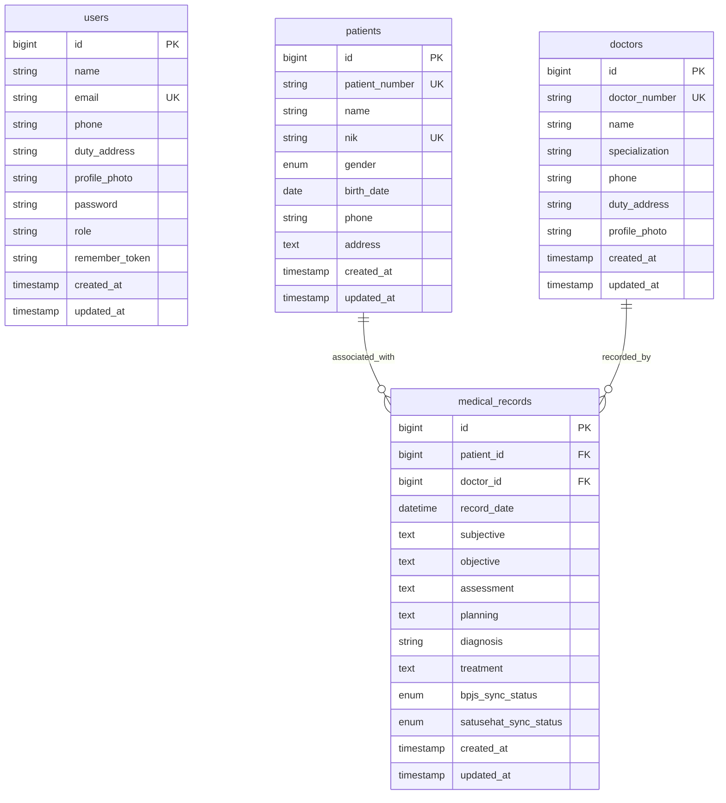
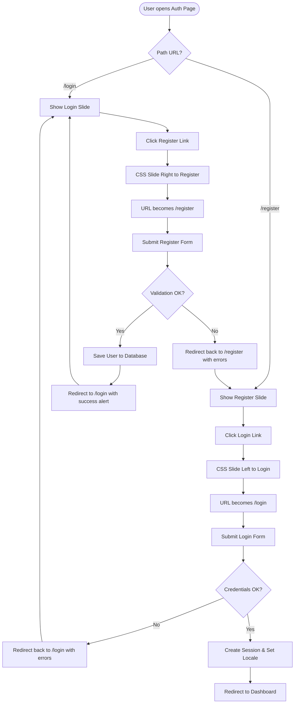
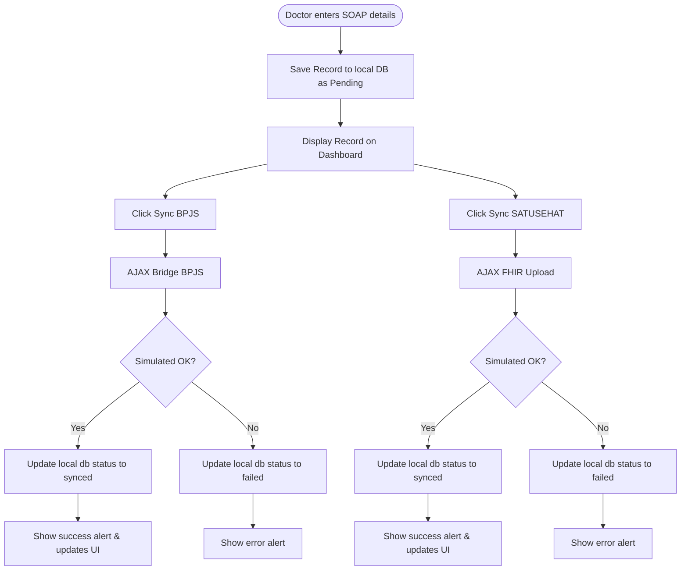

# Blueprint & System Architecture - SIMRS & RME Core

This document outlines the blueprints, database schema, entity-relationship diagram (ERD), data flow diagrams (DFD), and flowcharts for the **SIMRS & RME Core** application to help developer onboarding.

---

## 1. Data Flow Diagrams (DFD)

### DFD Level 0 (Context Diagram)
The Context Diagram represents the overall boundaries of the system, showing how authenticated users (Staff, Doctor, Admin) interact with the core application and how the application integrates with external BPJS and SATUSEHAT health APIs.

### DFD Level 1 (Detailed Process Diagram)
The DFD Level 1 details the core processes within the application and shows where data reads/writes take place relative to specific databases and actors.

---

## 2. Database Schema

The database consists of four primary tables mapping user authentication, medical entities, and SOAP clinical record transactions.

### 1. Table: `users`
Stores user credentials and roles for logging into the SIMRS administration dashboard.
| Column | Data Type | Attributes | Description |
| :--- | :--- | :--- | :--- |
| `id` | bigint | Primary Key, Auto Increment | Unique user identifier. |
| `name` | varchar(255) | Not Null | Full name of the user/staff. |
| `email` | varchar(255) | Unique, Not Null | Email used for logging in. |
| `phone` | varchar(255) | Nullable | Phone number of the staff. |
| `duty_address`| varchar(255) | Nullable | Specific station or room assigned. |
| `profile_photo`| varchar(255) | Nullable | Filepath to profile photo. |
| `password` | varchar(255) | Not Null | Hashed password. |
| `role` | varchar(255) | Default: `'staff'` | Role: `'admin'`, `'doctor'`, or `'staff'`. |
| `remember_token`| varchar(100) | Nullable | Login session token. |
| `created_at` | timestamp | Nullable | Timestamp of creation. |
| `updated_at` | timestamp | Nullable | Timestamp of last update. |

### 2. Table: `patients`
Stores demographic data for registered hospital patients.
| Column | Data Type | Attributes | Description |
| :--- | :--- | :--- | :--- |
| `id` | bigint | Primary Key, Auto Increment | Unique patient identifier. |
| `patient_number`| varchar(255) | Unique, Not Null | Unique RM Code (e.g. `RM-XXXXXX`). |
| `name` | varchar(255) | Not Null | Full name of the patient. |
| `nik` | varchar(16) | Unique, Not Null | Indonesian national identity number. |
| `gender` | enum('L','P') | Not Null | Gender: `'L'` (Male), `'P'` (Female). |
| `birth_date` | date | Not Null | Patient date of birth. |
| `phone` | varchar(255) | Nullable | Contact phone number. |
| `address` | text | Nullable | Resident address details. |
| `created_at` | timestamp | Nullable | Timestamp of creation. |
| `updated_at` | timestamp | Nullable | Timestamp of last update. |

### 3. Table: `doctors`
Stores professional profiles for medical practitioners.
| Column | Data Type | Attributes | Description |
| :--- | :--- | :--- | :--- |
| `id` | bigint | Primary Key, Auto Increment | Unique doctor identifier. |
| `doctor_number`| varchar(255) | Unique, Not Null | Unique registration code. |
| `name` | varchar(255) | Not Null | Full name of the doctor. |
| `specialization`| varchar(255) | Not Null | Area of expertise (e.g. Cardiologist). |
| `phone` | varchar(255) | Nullable | Contact phone number. |
| `duty_address`| varchar(255) | Nullable | Practice room or wing code. |
| `profile_photo`| varchar(255) | Nullable | Filepath to profile image. |
| `created_at` | timestamp | Nullable | Timestamp of creation. |
| `updated_at` | timestamp | Nullable | Timestamp of last update. |

### 4. Table: `medical_records`
Stores patient Electronic Medical Records (RME) formatted under standard SOAP protocols.
| Column | Data Type | Attributes | Description |
| :--- | :--- | :--- | :--- |
| `id` | bigint | Primary Key, Auto Increment | Unique record identifier. |
| `patient_id` | bigint | Foreign Key, Not Null | References `id` on `patients` (cascade delete). |
| `doctor_id` | bigint | Foreign Key, Not Null | References `id` on `doctors` (cascade delete). |
| `record_date` | datetime | Not Null | Exact date and time of assessment. |
| `subjective` | text | Not Null | **Subjective (S)**: Patient complaints. |
| `objective` | text | Not Null | **Objective (O)**: Vital signs & exams. |
| `assessment` | text | Not Null | **Assessment (A)**: Diagnosis conclusions. |
| `planning` | text | Not Null | **Planning (P)**: Therapy, treatments, dosage. |
| `diagnosis` | varchar(255) | Not Null | Standard primary diagnosis. |
| `treatment` | text | Nullable | Extra therapy remarks/prescriptions. |
| `bpjs_sync_status`| enum('pending','synced','failed')| Default: `'pending'` | Bridging status to BPJS VClaim API. |
| `satusehat_sync_status`| enum('pending','synced','failed')| Default: `'pending'` | Bridging status to SATUSEHAT FHIR API. |
| `created_at` | timestamp | Nullable | Timestamp of creation. |
| `updated_at` | timestamp | Nullable | Timestamp of last update. |

---

## 3. Entity Relationship Diagram (ERD)

The logical data modeling exhibits a **One-to-Many** relationship starting from both `patients` and `doctors` to `medical_records`. A patient can have multiple medical records, and a doctor can record multiple medical records.

---

## 4. System Flowcharts

### 1. Unified Authentication & Language Switching Flow
This flowchart details how the new single-page sliding auth card shifts and manages history push states without browser reloads.

### 2. SOAP Recording & API Sync Flow
This flowchart traces how a doctor enters a new RME and how data bridging is synchronized with BPJS and SATUSEHAT.

